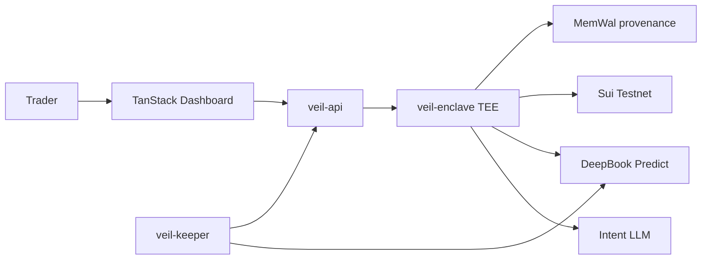

<p align="center">
  
</p>

<h1 align="center">Veil</h1>

<p align="center">
  <strong>Intelligent stealth execution for DeepBook Predict on Sui.</strong><br/>
  Trade smarter. Stay invisible.
</p>

<p align="center">
  <a href="https://veil-reviewer.vercel.app">Live demo</a> ·
  <a href="docs/JUDGES.md">Judge guide (2 min)</a> ·
  <a href="docs/OVERFLOW-SUBMISSION.md">Submission pack</a> ·
  <a href="docs/ARCHITECTURE.md">Architecture</a> ·
  <a href="docs/DEMO-SCRIPT.md">Demo script</a>
</p>

<p align="center">
  Sui Overflow 2026 · DeepBook track · Nautilus TEE · Walrus MemWal
</p>

---

## What is Veil?

**Veil** turns plain-English trading intent into **stealth, on-chain TWAP execution** on [DeepBook Predict](https://predict-server.testnet.mystenlabs.com) testnet.

You type what you want — *"15m BTC long, quick scalp"* — and Veil's enclave parses **mode**, **asset**, and **horizon**, then executes real Predict mints through **your own PredictManager**. Every fill is **TEE-attested**, stored in the proof console, and verifiable at `/attest/{hash}`.

No mempool parent order. No shared custody pool. No simulated fills.

---

## Why it matters

| Problem | Veil approach |
|---------|----------------|
| Public order flow | Parent intent stays off-chain; slices execute inside the enclave |
| Complex DeFi UX | GPT intent → auto-configured order (locked form) |
| "Trust me" execution | TEE-signed attestation + Move `execution_proof` + MemWal blob |
| Predict integration | Live BTC/USDC oracles, user PredictManager, permissionless redeem |

---

## Architecture



**Full diagrams:** [docs/ARCHITECTURE.md](docs/ARCHITECTURE.md) — system overview, sequence flows, four modes, deployment topology.

---

## Four execution modes

| Mode | Description |
|------|-------------|
| **BULL** | Directional stealth TWAP — sequential on-chain Predict mints |
| **BEAR** | Yield + tail hedge via covered range vault path |
| **EARN** | Idle dUSDC → PLP supply; keeper redeems and compounds |
| **PARLAY** | Correlated multi-leg predictions, single attested execution |

---

## Try it in 2 minutes

**Live app:** [https://veil-reviewer.vercel.app](https://veil-reviewer.vercel.app)

1. **Begin Journey** → sign in with Google or Sui Wallet  
2. **Portfolio** → create PredictManager → deposit [dUSDC](https://tally.so/r/Xx102L)  
3. **New Order** → `15m BTC long — quick scalp` → submit (wait ~90s for seal)  
4. **Proofs** → open attestation → `/attest/{hash}`  

Judges: no repo clone required. See [docs/JUDGES.md](docs/JUDGES.md).

---

## Demo video

**https://youtu.be/byFuYmAPL6Q**

Word-for-word recording script: **[docs/DEMO-SCRIPT.md](docs/DEMO-SCRIPT.md)**

---

## Monorepo

| Path | Role |
|------|------|
| [`src/`](src/) | TanStack Start UI — dashboard, auth, attest viewer |
| [`packages/move/veil`](packages/move/veil) | Move: `registry`, `attestation`, `execution_proof`, `parlay`, `events` |
| [`packages/execution-engine`](packages/execution-engine) | SVI surface, Kelly sizing, TWAP scheduling, mode planners |
| [`packages/sdk`](packages/sdk) | Predict PTBs, intent LLM, on-chain TWAP, clients |
| [`packages/veil-enclave`](packages/veil-enclave) | TEE HTTP server — parse, execute, verify |
| [`packages/walrus-reporter`](packages/walrus-reporter) | MemWal / Walrus provenance adapter |
| [`services/veil-api`](services/veil-api) | API gateway, orders, settlement, leaderboard |
| [`services/keeper`](services/keeper) | Earn mode redeem + PLP drip |
| [`api/execute.ts`](api/execute.ts) | Vercel long-timeout execute proxy |

---

## Quick start (local)

```bash
git clone https://github.com/henrysammarfo/veil.git
cd veil
npm install --legacy-peer-deps
cp .env.example .env   # fill secrets locally — never commit
```

```bash
npm run enclave   # :8080
npm run api       # :8787
npm run dev       # :5173
npm run keeper    # optional
```

```bash
npm run smoke         # read-only health
npm run smoke:live    # wallet + on-chain TWAP + LLM
npm run ci            # lint + typecheck + test + build
```

---

## Testnet contracts

| | Address |
|---|---------|
| **Veil package (Sui testnet)** | `0xb69f928ef4cd96ea9f0cb6c6d3e559f4cece9c500f56d2fb9199569d222d54da` |
| **Predict server** | https://predict-server.testnet.mystenlabs.com |
| **Live market** | BTC/USDC |
| **dUSDC faucet** | https://tally.so/r/Xx102L |

---

## Deploy

| Branch | Vercel project | Command |
|--------|----------------|---------|
| `main` | Reviewer / demo | `npm run build:production` |
| `deploy/waitlist` | Public waitlist | `npm run build:waitlist` |

Cloud backend: [docs/AZURE-SSH.md](docs/AZURE-SSH.md) · Vercel: [docs/DEPLOY.md](docs/DEPLOY.md)

---

## Documentation

| Doc | Purpose |
|-----|---------|
| [ARCHITECTURE.md](docs/ARCHITECTURE.md) | System design + mermaid diagrams |
| [DEMO-SCRIPT.md](docs/DEMO-SCRIPT.md) | Word-for-word demo video script |
| [JUDGES.md](docs/JUDGES.md) | Reviewer quick path |
| [DEPLOY.md](docs/DEPLOY.md) | Vercel + env checklist |
| [DEMO-SHOTLIST.md](docs/DEMO-SHOTLIST.md) | Visual shot list (companion to script) |
| [SECURITY.md](SECURITY.md) | Scope and limitations |

---

## Environment

Copy [`.env.example`](.env.example). Never commit secrets.

| Variable | Purpose |
|----------|---------|
| `VITE_ENOKI_PUBLIC_KEY` / `VITE_GOOGLE_CLIENT_ID` | zkLogin (frontend) |
| `OPENAI_API_KEY` | LLM intent parsing (enclave/API) |
| `SUI_PRIVATE_KEY` | Move publish, keeper, PTBs |
| `PREDICT_MANAGER_ID` / `PREDICT_ORACLE_ID` | Predict testnet objects |
| `TWAP_MAX_SLICES` | On-chain mints per BULL order (default 5) |

---

## Security

Veil uses a **TEE template** for hackathon demo — not a production security audit. Do not claim unhackable execution. See [SECURITY.md](SECURITY.md).

---

## License & credits

Built for **Sui Overflow 2026** · **DeepBook** special track.

**Team:** [Henry Marfo](https://github.com/henrysammarfo) · [@henrysammarfo](https://x.com/henrysammarfo)

<p align="center"><sub>Trade smarter. Stay invisible.</sub></p>
