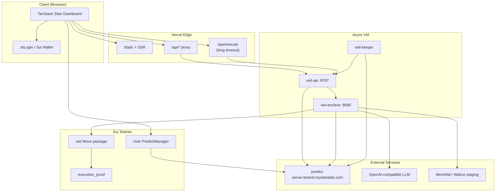
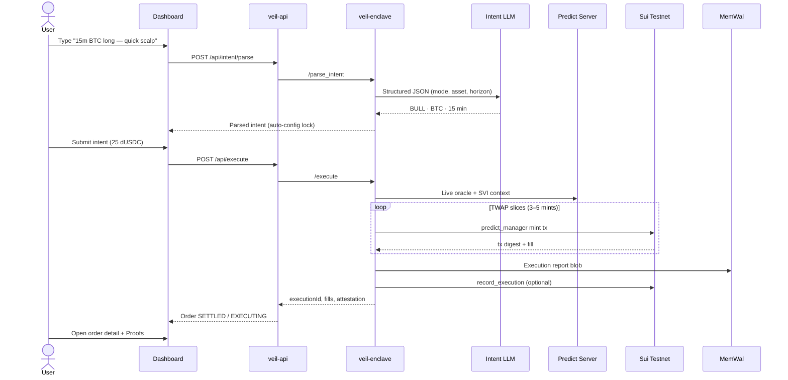
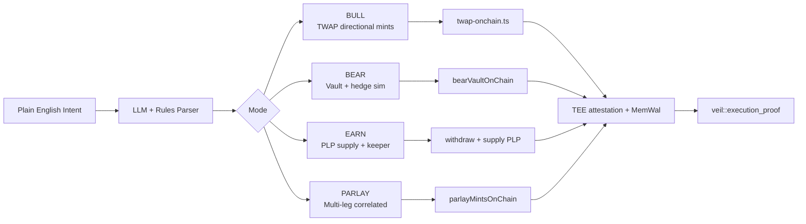
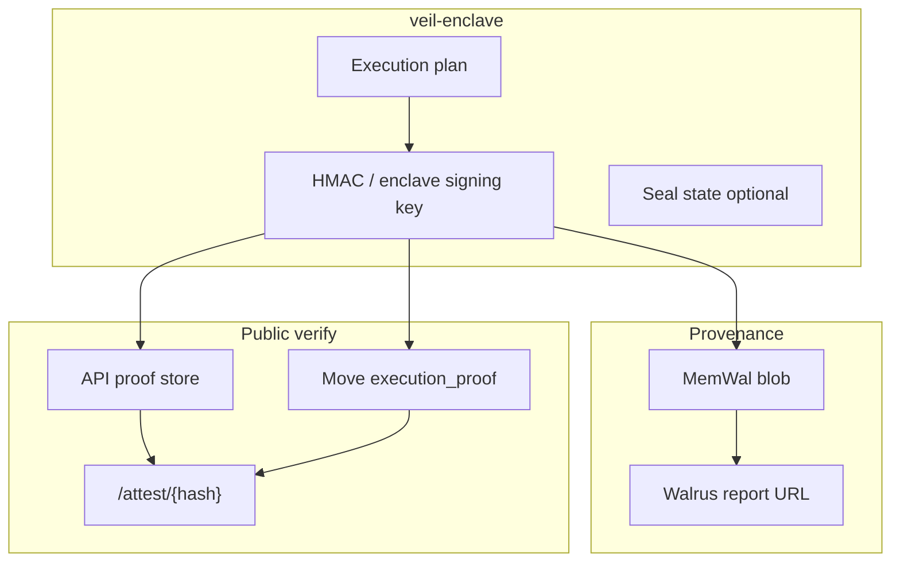
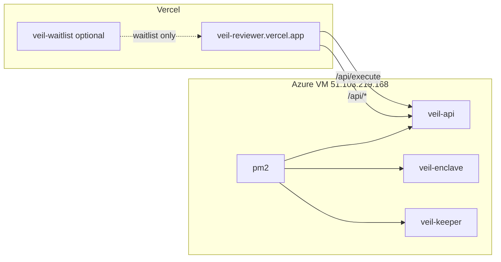

# Veil Architecture

Veil is a stealth execution layer for **DeepBook Predict** on Sui testnet. Users express intent in plain English; a TEE enclave plans and signs execution; the API records orders and proofs; on-chain Move modules anchor attestations.

**Live demo:** [veil-reviewer.vercel.app](https://veil-reviewer.vercel.app)

---

## System overview



---

## Order lifecycle (BULL / 15m example)



---

## Four execution modes



| Mode | On-chain behavior | Capital |
|------|-------------------|---------|
| **BULL** | Sequential Predict mint txs (TWAP slices) | User PredictManager dUSDC |
| **BEAR** | Covered range / vault path | User PredictManager |
| **EARN** | Withdraw idle → PLP supply; keeper redeems | User PredictManager |
| **PARLAY** | Correlated multi-leg mints + parlay record | User PredictManager |

---

## Trust & verification



Every execution produces:

1. **TEE-signed attestation payload** (enclave HMAC / execution digest)
2. **MemWal blob** with full execution metadata
3. **On-chain `execution_proof`** (when trader address + registry configured)
4. **Dashboard proof console** + public `/attest/{hash}` page

---

## Monorepo map

```
veil/
├── src/                      TanStack Start UI (dashboard, auth, attest)
├── api/execute.ts            Vercel serverless — long-running execute proxy
├── packages/
│   ├── move/veil/            Sui Move: registry, attestation, execution_proof, parlay
│   ├── execution-engine/     SVI, Kelly, TWAP scheduling, mode planners
│   ├── sdk/                  Predict PTBs, intent LLM, twap-onchain, clients
│   ├── veil-enclave/         TEE HTTP server (parse, execute, verify)
│   └── walrus-reporter/      MemWal adapter
└── services/
    ├── veil-api/             Gateway, order store, settlement sync, leaders
    └── keeper/               Earn redeem + PLP drip loop
```

---

## Deployment topology



| Surface | URL / port | Role |
|---------|------------|------|
| Reviewer app | `https://veil-reviewer.vercel.app` | Judges & demo |
| veil-api | `:8787` | REST gateway, order persistence |
| veil-enclave | `:8080` | Intent parse + execute (TEE) |
| veil-keeper | background | Redeem settled → PLP drip |

---

## DeepBook Predict integration

| Resource | Testnet value |
|----------|----------------|
| Predict server | `https://predict-server.testnet.mystenlabs.com` |
| Live market | **BTC/USDC** |
| dUSDC faucet | [tally.so/r/Xx102L](https://tally.so/r/Xx102L) |
| Veil Move package | `0xb69f928ef4cd96ea9f0cb6c6d3e559f4cece9c500f56d2fb9199569d222d54da` |

User flow: **wallet dUSDC → PredictManager deposit → enclave mints → permissionless redeem → manager balance**.

---

## Key design decisions

1. **User-owned PredictManager** — judges and users keep custody; Veil never pools customer funds in a shared demo wallet for production flow.
2. **Real TWAP** — each slice is a separate on-chain Predict mint (`twap-onchain.ts`), not a simulated fill counter.
3. **Intent-locked UI** — LLM sets mode, asset, and horizon; manual override disables submit to prevent horizon mismatch.
4. **Long execute path** — Vercel `/api/execute` serverless function avoids 502 on 60–90s enclave sealing.
5. **SETTLED vs redeem** — UI "SETTLED" means slices complete; Portfolio redeem unlocks after Predict market horizon + oracle settlement.

---

## Related docs

- [Demo video script](./DEMO-SCRIPT.md) — word-for-word recording guide
- [Judge guide](./JUDGES.md) — 2-minute path for reviewers
- [Deploy](./DEPLOY.md) — Vercel + Azure
- [Security](../SECURITY.md) — scope and limitations
